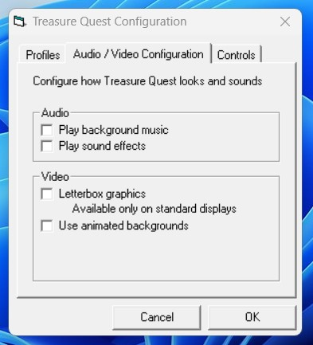
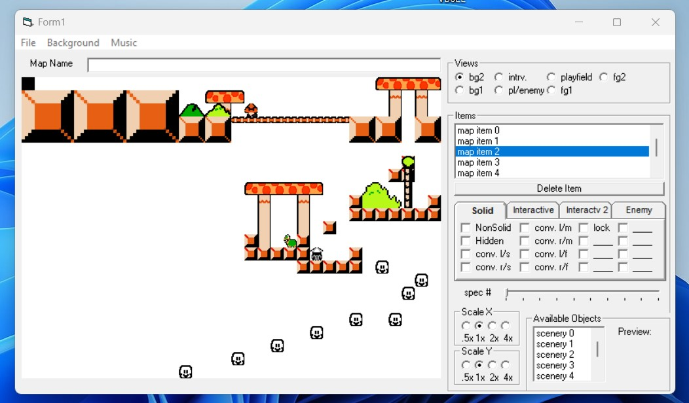
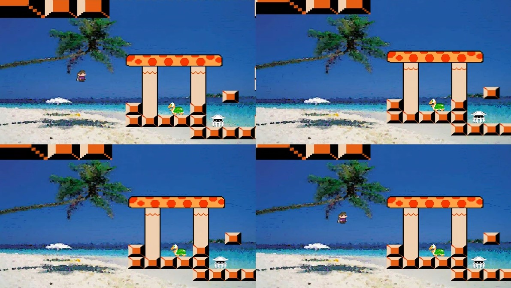

# Treasure Quest, v2

This project is my **third** attempt at making a two-dimensional [Jetpack](https://en.wikipedia.org/wiki/Jetpack_(video_game)) and/or [Lode Runner](https://en.wikipedia.org/wiki/Lode_Runner) clone within Visual Basic. It was written in the second half of 2007.

Unfortunately, my *very first* attempt at developing such a game from 1999/2000 is long gone, whereas the second iteration (and the first to survive to present day) from around 2005/6 will be uploaded to GitHub after some reverse engineering.

Regardless, these three versions all share similarities:
* Written in Visual Basic 6 (or earlier)
* Leverage GDI, [BitBlt](https://learn.microsoft.com/en-us/windows/win32/api/wingdi/nf-wingdi-bitblt), and/or [StretchBlt](https://learn.microsoft.com/en-us/windows/win32/api/wingdi/nf-wingdi-stretchblt)
* Leverage sprites and music from at-the-time contemporary video games (nowadays, I would not use such copyrighted content in my prototypes)

Of the three versions, this game would be considered the most technically complex and best performing. It allowed sprites and objects to be scaled on the X/Y axises, had scrolling backgrounds, and even [four-player splitscreen gameplay](https://www.youtube.com/watch?v=UZ1pFyBRh7Q) was early in development.

There are three projects in this repository:
* *Game*, which loads a map for playing
* *Editor*, which allows users to load and edit a map
* *Config*, a non-functional prototype for editing game configuration files

It has been uploaded and archived to GitHub for posterity. The [provided license](SOURCECODE-LICENSE) applies only to the project's sourcecode *and* not any included media assets.

